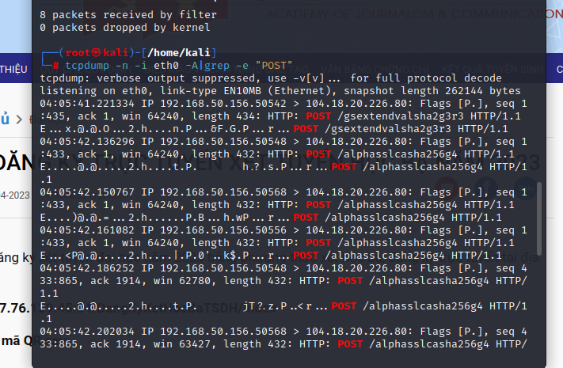

# Content

- [Content](#content)
  - [Link lab](#link-lab)
  - [Steps](#steps)
  
## [Link lab](https://www.101labs.net/comptia-security/lab-51-packet-capture-with-tcpdump)

## Steps

- The tcpdump tool is already included in Kali.
- To begin capturing packets, I first need to select the interface that I want to use for packet capture. I can list all interfaces available to us using the following command: `tcpdump -D`
  
- If i choose the eth0 interface, I can start capturing packets using the following command: `tcpdump -i eth0`. This will start capturing packets on the eth0 interface and display them on the screen.
  
- When using tcpdump without adding the "-n" parameter, captured packets are displayed on the screen with the hostname and port name (if applicable) instead of the IP address and port number. This can make the packet capture process a bit slower since it requires a DNS lookup to decode the hostnames into IP addresses.
- When adding the "-n" parameter to the command, tcpdump will display IP addresses and port numbers instead of hostnames and port names. This can help speed up packet capture and reduce the load on the system when it is not necessary to perform DNS lookups.
  
- If i use the -c parameter, which will help us to capture the exact amount of data that I need and display them. It refines the amount of data I captured: `tcpdump -n -i eth0 -c 5`
  
- I can also get the ethernet header (link layer headers) by appending “-e” to the command above. This will display the source and destination MAC addresses of the packets captured.
  
- I can also use tcpdump to filter packets based on several expressions. If I want to view only TCP packets, I can use the following command: `tcpdump -n -i eth0 tcp`
  
- I can input a variety of combinations of commands to gather different packets from a network. For example, this next command will display the SSH packets coming from one source and going to another destination. `tcpdump "src 192.168.50.156 and dst 142.250.199.67 and port 80"`
  
- To print each packet in ASCII code, we need to use “-A” parameter. This next command is an example of using grep with tcpdump to help it only display information I deem to be important. `tcpdump -n -i eth0 -A | grep -e "POST"`
- This command will begin gathering all packets using tcpdump, and I then use grep to find and display all POST requests to us.
  
- Finally, I will attempt to capture usernames and passwords submitted through a http form from a device on the network. We will use the following command to do this:
  `tcpdump -nnvvXSs 1514 -i eth0 'tcp port 80'`
  - -n: Disable DNS resolution for IP addresses and ports. This speeds up packet capture.
  - -nn: Same as -n, but also disables domain name resolution for protocol numbers.
  - -v: Show more details about captured network packets.
  - -vv: Show more detailed information than -v.
  - -X: Display payload of TCP or UDP packets.
  - -S: Displays the sequence number of the packets.
  - -s : Set the buffer size of tcpdump. In your example, -s 1514 sets the buffer size to 1514 bytes. This helps tcpdump to capture full packets without being cated when it exceeds the default buffer size.
- Link website: [Web](http://testphp.vulnweb.com/login.php)
  