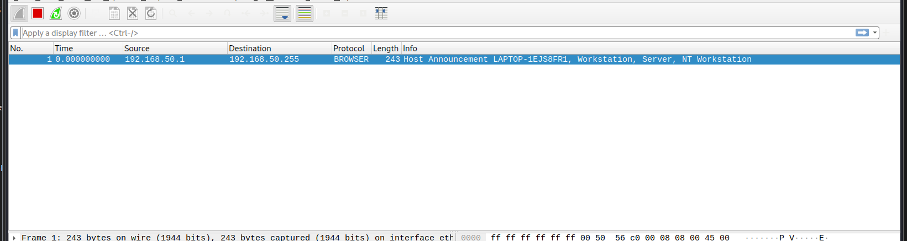
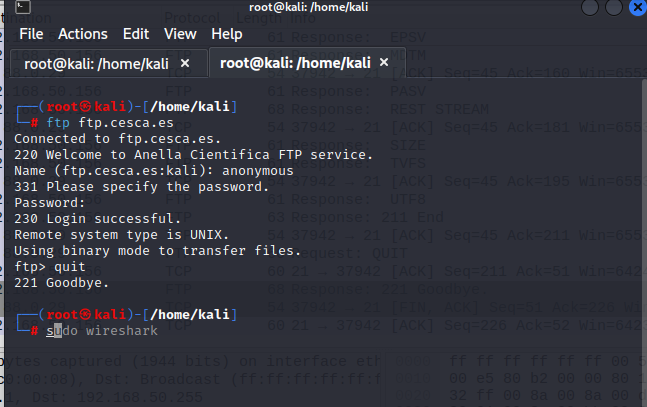
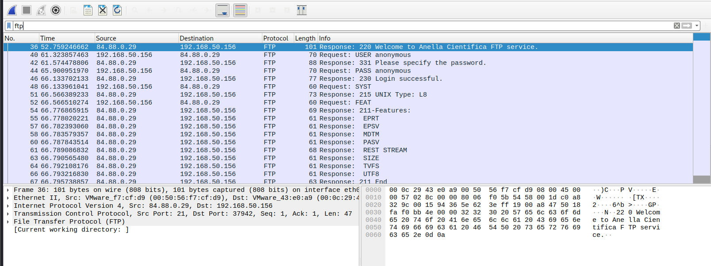
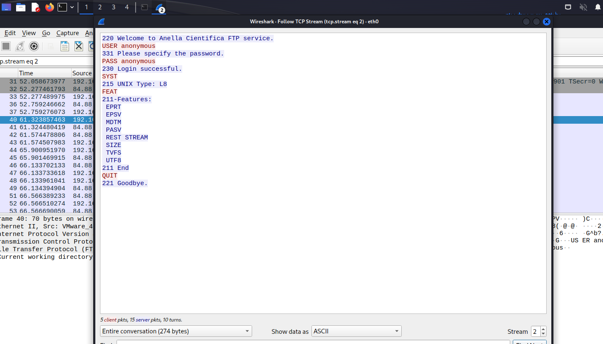
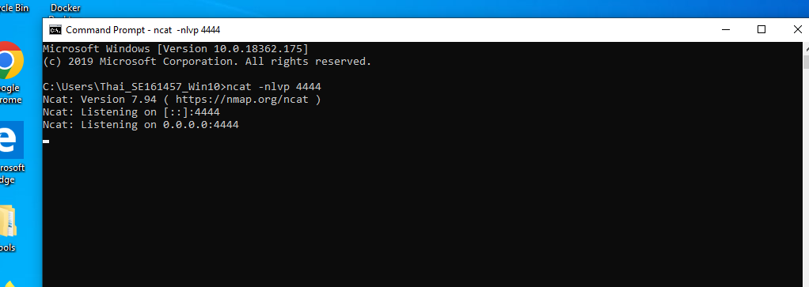
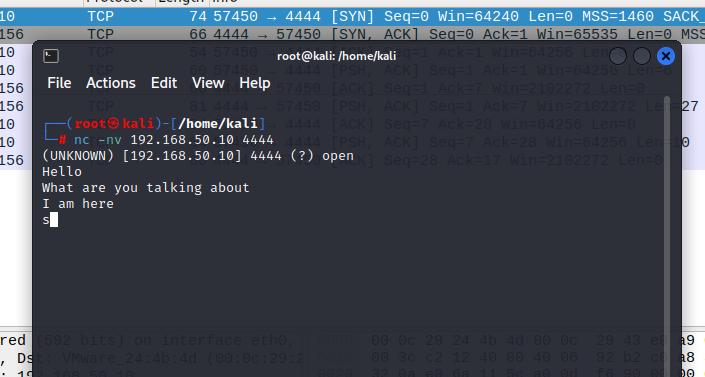
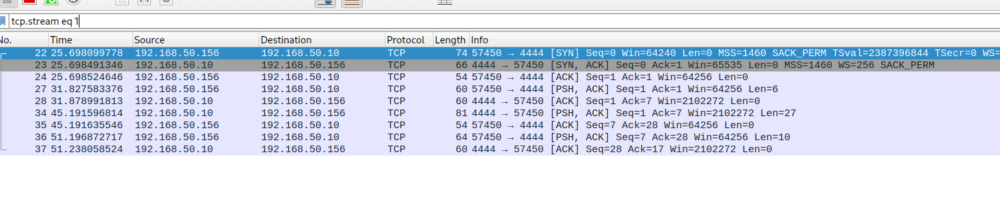
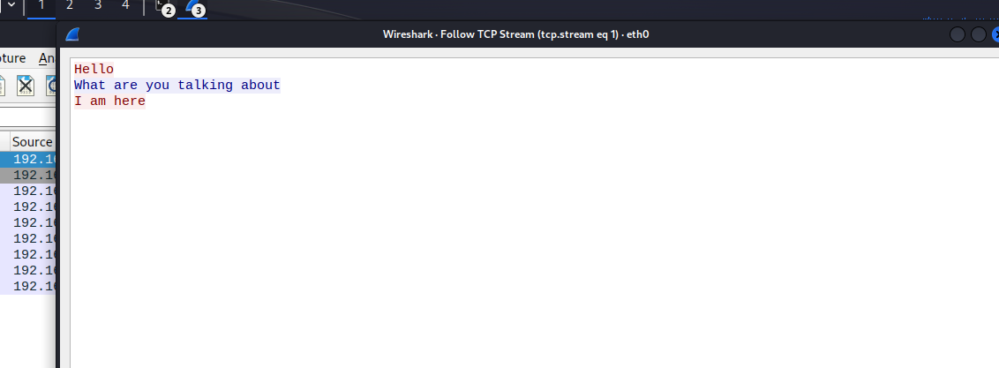

# Content

- [Content](#content)
  - [Display the filter and folloing the TCP Streams of FTP server](#display-the-filter-and-folloing-the-tcp-streams-of-ftp-server)
  - [Try with netcat](#try-with-netcat)
  
## Display the filter and folloing the TCP Streams of FTP server

- First, i start to wireshark in Kali and capture the local network.
- Then, i try to log in to the FTP anonymous server.
  
  
- Then, i filter to traffic in wire shark by using the filter `ftp` and or tcp.port == 21 (port 21 is the port of FTP)
  
- Finally, i open TCP Stream to see the traffic of FTP.
  

## Try with netcat

- In Windows, i open cmd and type `ncat -nlvp 4444` to create a chat between 2 computer. 
  
- In Kali, i type command `nc -nv 192.168.50.10 4444` to connect to the chat. I use wire shark to capture the traffic of this chat.
  
- I filter the traffic by using the filter `tcp.port == 4444` and open TCP Stream to see the traffic of this chat. (Port 443 is the port of HTTPS)
  
  

