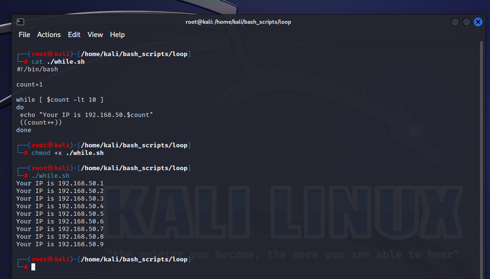
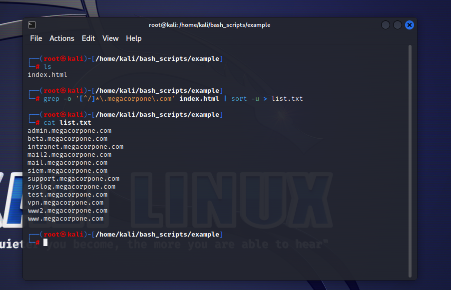
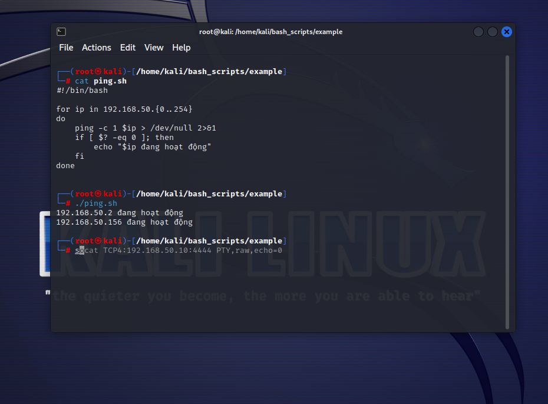

# Content

- [Content](#content)
  - [Variables](#variables)
    - [Arguments](#arguments)
    - [Reading User Input](#reading-user-input)
  - [If, Else, Elif Statements](#if-else-elif-statements)
  - [Boolean Logical Operations](#boolean-logical-operations)
  - [Loops](#loops)
    - [For Loops](#for-loops)
    - [While Loops](#while-loops)
  - [Functions](#functions)
  - [Practical](#practical)
    - [Example 1](#example-1)
    - [Example 2](#example-2)
  
## Variables

### Arguments

- We can supply command-line arguments and use them in our 
scripts.
  

### Reading User Input

- Command-line arguments are a form of user input, but we can also capture interactive user input while a script is running with the read command. In this example, we will use read to capture user input and assign it to a variable.
  
- Command-line arguments are a form of user input, but we can also capture interactive user input while a script is running with the read command. In this example, we will use read to capture user input and assign it to a variable.
  

## If, Else, Elif Statements

- The if statement is relatively simple–it checks to see if a condition is true–but it requires a very specific syntax. Pay careful attention to this syntax, especially the use of required spaces.
`if [ <some test> ]
then
 <perform an action>
fi` 
 
- Some of the most common operators include:
  
- We can also perform a certain set of actions if a statement is true and another set if it is false. To do this, we can use the else statement, which has the following syntax.
`if [ <some test> ]
then
 <perform action>
else
 <perform another action>
fi`
 
- The if and else statements only allow two code execution branches. We can add additional branches with the elif statement which uses the following pattern.
`if [ <some test> ]
then
 <perform action>
elif [ <some test> ]
then
 <perform different action>
else
 <perform yet another different action>
fi`
 

## Boolean Logical Operations

- These operators can also be used in a test to compare variables or the results of other tests. When used this way, AND (&&) combines two simple conditions, and if they are both true, the combined result is success (or True or 0).
  
- These operators can also be used in a test to compare variables or the results of other tests. When used this way, AND (&&) combines two simple conditions, and if they are both true, the combined result is success (or True or 0).
  

## Loops

### For Loops

- For loops are very practical and work very well in Bash one-liners.122 This type of loop is used to perform a given set of commands for each of the items in a list. Let’s briefly look at its general syntax.
`for var-name in <list>
do
 <action to perform>
done`
  

### While Loops

- While loops are also fairly common and execute code while an expression is true. While loops have a simple format and, like if, use the square brackets ([]) for the test.
`while [ <some test> ]
do
 <perform an action>
done`
 

## Functions

-  Functions may be written in two different formats. The first format is more common to Bash scripts.
`function function_name {
commands...
}`
- The second format is more familiar to C programmers.
`function_name () {
commands...
}`
 
 
- In bash, $? is a special variable containing the exit code of the last command executed. It returns the value of the last command executed and is used to determine if the command executed successfully. If the return value of the command is 0, it means that the command has executed successfully, while different values can indicate a specific error for the failure of the command.
- In this example, $? is used to get the return value from the return_me function, then that value is printed to the screen.
  
## Practical

### Example 1

- In this example, we want to find all the subdomains listed on the main megacorpone.com web page and find their corresponding IP addresses.
- First, we will start by downloading the index page with wget.
  
- We will use a simple regular expression to carve “.megacorpone.com” subdomains out of our file.
  
- Now we have a nice, clean list of domain names linked from the front page of megacorpone.com. Next, we will use host to discover the corresponding IP address of each domain name in our text file. We can use a Bash one-liner loop for this.
  

### Example 2
- Research Bash loops and write a short script to perform a ping sweep of your target IP range of 192.168.50.0/24.
  